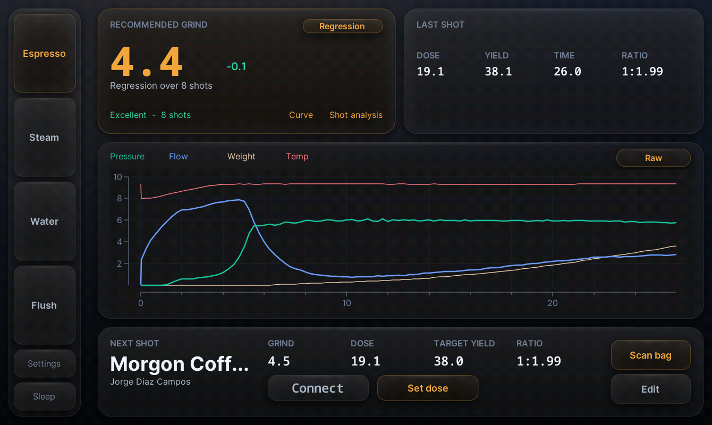

# Lumen

A glass dashboard skin for the Decent DE1, by Blastize.

Lumen replaces the home screen with a dashboard: the current grind
recommendation, the last shot, the shot graph, and the beans for the next
shot — all reachable without going into Settings. It is built to work with
GrindAdvisor, DYE, Bean Scanner, ShotHistoryEditor and SDB.

**Version 0.17.0 — home dashboard, shot chart and flow pages all built and
running on the tablet.** 0.17.0 adds a **Curve** control to the grind tile,
opening GrindAdvisor's calibration plot directly.

## The home screen



Everything above is one page: the grind recommendation with its method and
confidence, the last shot's numbers, the full shot graph, and the next shot's
bean and targets. A light theme ships alongside this dark one — it is not an
inversion, since on a pale ground the panels have to sit *brighter* than the
backdrop and let the shadow do the separating.

## What the home screen does

| Tile | Shows | Tap |
|---|---|---|
| Grind | GrindAdvisor's next setting, the change from the last one, method, confidence and shot count | Opens GrindAdvisor's result popup |
| Curve (on the grind tile) | — | Opens GrindAdvisor's Calibration Curve directly |
| Last shot | Dose, yield, time, ratio | — |
| Graph | Pressure, flow, cumulative weight and basket temperature for the shot | **Raw / Smooth** toggle in its header |
| Next shot | Bean, roast date, grind, dose, target yield, ratio | Opens DYE's next-shot editor |
| Scale readout | Live weight, or `Connecting` / `Connect` / `no scale` | Forces a scale reconnect |
| Set dose | — | Stores the current scale weight as the dose |
| Scan bag | — | Opens Bean Scanner |

The Grind tile's method chip names the rung GrindAdvisor used: **First shot**
(1 shot on the bag), **2-shot**, **Regression** (3 or more), or **Pairwise**
when the regression is too flat to solve.

## If the scale does not connect

Tap the weight readout. The app only retries a dropped scale about 20 times,
roughly 10 seconds apart, and then stops for good — so a scale switched on a
few minutes late is never picked up on its own. Tapping the readout clears the
app's retry counter and starts a fresh connection attempt; it shows
`Connecting` while one is in flight.

## During a shot

Espresso, steam, water and flush each get their own page: what the machine is
doing, a large elapsed timer, and live pressure / flow / weight / temperature.
Tap anywhere to stop — including on flush, which the stock skin does not offer.

Everything degrades gracefully: with a plugin missing or disabled the values
read `--` and the buttons log a line to the app log rather than failing
silently. Look for `Lumen:` in the log if a button seems dead.

Dose and grinder setting persist across shots in the DE1app, so "last shot"
and "next shot" show the same figures until you change them. That is the
app's own behaviour, not a quirk of the skin.

## Typography

Inter for UI text, NotoSansMono for every number — doses, yields, times and
grind settings line up in columns, and a proportional face makes those
columns ragged. Both families ship in `fonts/` and are already proven on this
tablet.

The skin does not use the app's `load_font`, because that hands a *positive*
(point) size to `font create`, scaled by `::settings(default_font_calibration)`
— 0.5 on this tablet — which makes text size unpredictable across DPI. Lumen
takes only the family name from the font loader and creates every font itself
at negative (pixel) sizes, with a 16px floor. If the TTFs cannot be
registered, each face falls back to Helvetica or Courier.

## Install

Copy the `Lumen` folder to `de1plus/skins/` on the tablet, so you end up with:

```
de1plus/skins/Lumen/skin.tcl
de1plus/skins/Lumen/fonts/
```

Then pick it in **Settings → Tablet → (skin list)**.

### If Lumen does not appear in the skin list

The app hides unknown skins by default. `skin_directories` in
`de1app-core/vars.tcl` filters the list against a hardcoded
`most_popular_skins` set whenever `show_only_most_popular_skins` is 1 — and
1 is the default.

Turn off **"Only show most popular skins"** on that same Tablet settings
page and Lumen will appear.

## What it looks like

No image assets ship with this skin. Every panel is drawn with the app's own
canvas primitives, so it scales to any tablet and there is nothing to
regenerate if you change the palette.

Tk has no runtime backdrop blur and canvas shapes have no alpha channel, so
the frosted-glass effect is achieved by pre-compositing each translucent tone
against the page background by hand and adding a bright hairline along the
top edge of every panel. On a dark, low-detail background that reads as
glass.

## Themes

Dark and light are both defined. The mode is read once at load from
`::settings(lumen_theme)` (`dark` or `light`); it defaults to dark.

The **THEME** row on the Lumen settings page toggles it. Because the palette
is read once at load and every canvas item is created from it, the change
only lands when the skin is sourced again — so tapping **Done** after a theme
change quits the app, using the app's own restart-on-skin-change sequence
(`skins/default/de1_skin_settings.tcl:65-71`: message page, then `app_exit`).
Relaunch it and it comes up in the new theme. Toggling back to the theme you
started in does not quit.

**The app cannot reopen itself** on Android 16 — `am start` from the app's uid
is rejected by the platform, and `borg activity` would start the activity in
the process that is exiting. Changing skin in the stock settings behaves the
same way. The CHANGELOG entry for 0.15.0 has the measurements.

Note only a **dark** baked home-page background exists; light mode falls back
to vector panels.

## Layout basis

The whole file is authored in **design pixels on a 1340x800 basis** — the
same basis as the design mockup — and converted to the app's 2560x1600
virtual canvas through `::lumen::X` and `::lumen::Y`.

Those two factors are deliberately different: 2560/1340 is 1.9104 but
1600/800 is 2.0. Using a single factor for both axes drifts the layout
horizontally, which is why x and y convert separately.

All layout numbers live in one block, `::lumen::_init_layout`. Nothing below
it hardcodes a coordinate.

## Safety

No database is opened, and no file in `history/` or `history_v2/` is read,
written, renamed or deleted.

The skin writes exactly **one** value: `::settings(live_graph_smoothing_technique)`,
a stock DE1app display preference, and only when you tap the chart's
Raw/Smooth toggle. Nothing else in `::settings` is touched.

The grind tile, bean strip and Scan bag button hand off to GrindAdvisor, DYE
and Bean Scanner; any writing those perform is their own, behind their own
confirmation.

## Credits

The rounded-panel primitive is the same smoothed-polygon mechanism used in
the GrindAdvisor plugin. The stop-button bindings on the espresso, steam and
water pages are copied verbatim from `skins/default/standard_stop_buttons.tcl`.
The stock settings, firmware, descale and profile-editor pages come from
`skins/default/standard_includes.tcl` and are untouched.
